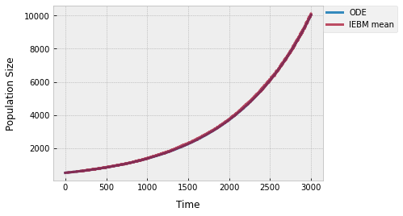
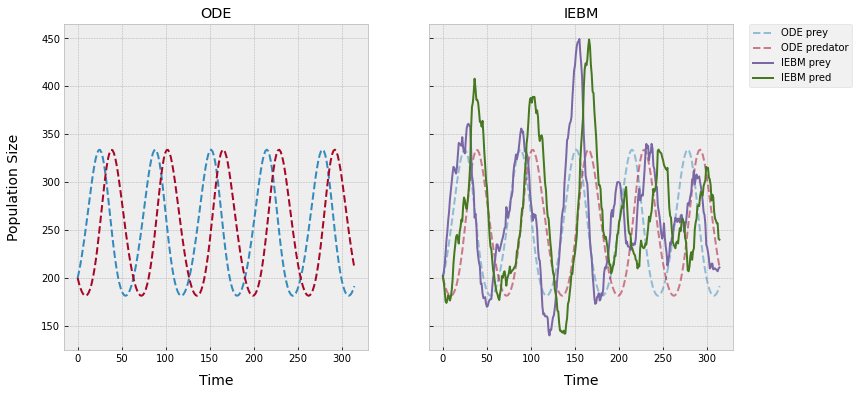
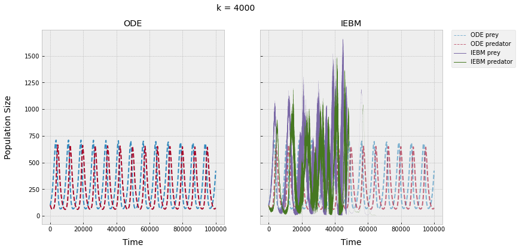

# Event-Based Ecology and Evolutionary Biology

A framework to simulate individual interactions and explore theoretical ecology and evolutionary biology (EEB). 

## Introduction

Nature is fascinating. From the ancient Greeks up until the mid 19th century, the prevailing Western philosophy believed nature to be in harmony &mdash; the perfect product of some creator. Evidence gathered by Darwin and others started to challenge the status quo, showing nature as dynamic and constantly changing (MAYR). Some of the best documentation of change came from Elton () who compiled historical fur pellet records from the Hudson Bay Company. Elton's findings depicted what First Nations and trappers long recognized in the boreal forest of Canada: the animal populations were not in balance, birth rates and death rates were not always equal, and the populations fluctuated every 7-10 years (Krebs). 

To explain long-term population fluctuations, Lotka (ref) and Volterra (ref) simultaneously formulated equations of predator-prey dynamics that cycle at equilibrium. The growth in the predator (lynx) and prey (hare) populations hinge on each other: the prey population grows when there are few predators and the predator population grows when there are more prey, leading to cycles.

Both Lotka and Volterra borrowed concepts from chemistry to model the populations as well-mixed ideal gases following the law of mass action. Individuals are assumed to behave like randomly colliding gas particles and interact at a the rate proportional to the concentrations of the populations. A plethora of theory in EEB  &mdash; from predation and competition to epidemiological infection models &mdash; are population-level equations built on the law of mass action. Maybe there are some natural systems that act like well-mixed randomly colliding ideal gases, but most likely don't &mdash; most systems have some degree of patchiness or organisms sensing and reacting. 

Theory in EEB needs to move away from these 100 year-old simple assumptions of mass action and start modelling more realistic non-random individual-level interactions. Ecology is often defined as the study of interactions between organisms and their environments &mdash; so theory should be able to model and examine different interaction strategies. 
Moreover, linking mutable traits to the interaction strategies can capture evolutionary dynamics in long running simulations. There are some individual-based models (IBMs) that try to capture individual interactions and examine EEB, but they tend to be overly complex, computationally expensive, or very specific to certain systems (GRIMM). This is a framework to build IBMs that are simple, efficient, robust, and founded on classic models of EEB.  

This framework follows four principles:

1. extension of classic population-level models
2. simple and efficient
3. general and robust
4. reproducible and distributed 

The first principle is to <u>extend</u> and build on theory, not to start a whole new paradigm. For example, as a base model, a predator-prey system can be created in which all organisms act like randomly colliding ideal gases. This base IBM would have the same dynamics as the Lotka-Volterra equations. Extensions to the base model can be added to compare the dynamics of patchiness and non-random interactions.

Most models in EEB are population-level ordinary differential equations (ODE) that can be turned into <u>simple and efficient</u> population-level event-based models (EBMs). The rate parameters in the differential equations are converted into event probabilities over a short timespan. Much more detail can be found in RENSHAW (). In brief, population-level EBMs randomly draw event times from the event probabilities, jump to the next event, and perform the population event &mdash; no computation is wasted on simulating times with no events. These population-level EBMs add demographic stochasticity to the base differential equation dynamics (BARLETT, MAY). 

A population-level EBM can further be extended into individual-level EBM (IEBM). This framework is inspired by the IEBM in Donalson & Dangelis (1999) termed HADES. Individuals are explicity modelled and assigned their own event times drawn from the population-level event probabilities. The most immediate event for each individual is stored in an *event_heap*. IEBMs pop the next event from the *event_heap* and call the individual to perform their event. After the event is carried out, new events are added to the *event_heap*.  With modern computers, it's now easier to program and simulate HADES and other IEBMs.

The framework is setup in pieces to be <u>robust and general</u>: different pieces can be combined to create all kinds of models. The code is written in Python and on GitHub to be <u>reproducible and distributed</u>. With Python, *NumPy* is used for efficient computing and the *datatable* package is used for manipulating dataframes of individuals. *Pandas* is a very popular Python dataframe package, but it's much slower when adding and removing rows. Ideally, *git* allows this framework to be distributed into branches and forks to keep new experimental systems all together.

## Overview

There are three classes that build an IEBM: *Population*, *Event*, and *Trait*. A *Population* contains a dataframe of individuals and a list of *Event* and *Trait* instances. Each individual in the *Population* is a row in the dataframe with a unique identifier. The other columns of the dataframe are individual trait values and event times, which depend on the respective *Trait* and *Event* instances. 
All *Event* classes have two functions: 
1. *set_next()*: calculates and sets the next event time for individuals.
2. *handle()* performs the event of a given individual. 
An *Event* can be primary and stored in the population dataframe or secondary and triggerd by a primary event. 

Exactly when and how an individual performs a primary *Event* depends on the individual *Trait* instances. A *Trait*, similar to an *Event*, can be 1) primary and have a value that can mutate or 2) linked and depend on other *Trait* values. 

The most immediate event for each individual is stored in an *event_heap*. A *Simulation* pops the next event from the *event_heap* and calls the individual within the *Population* to perform the event.

<table class="tg">
<thead>
  <tr>
    <th class="tg-0pky">ID</th>
    <th class="tg-0pky" colspan="2">Trait Values</th>
    <th class="tg-0pky" colspan="2">Event Times</th>
  </tr>
</thead>
<tbody>
  <tr>
    <td class="tg-0pky">1</td>
    <td class="tg-0pky">t11</td>
    <td class="tg-0pky">t21</td>
    <td class="tg-0pky">e11</td>
    <td class="tg-0pky">e21</td>
  </tr>
  <tr>
    <td class="tg-0pky">2</td>
    <td class="tg-0pky">t12</td>
    <td class="tg-0pky">t22</td>
    <td class="tg-0pky">e12</td>
    <td class="tg-0pky">e22</td>
  </tr>
  <tr>
    <td class="tg-0pky">...</td>
    <td class="tg-0pky"></td>
    <td class="tg-0pky"></td>
    <td class="tg-0pky"></td>
    <td class="tg-0pky"></td>
  </tr>
</tbody>
</table>

The Python code contains much more information. The best way to describe the framework is with examples. These examples recreate classic ODEs as IEBMs and explore relaxing assumptions. The experiment notebooks contain the model simulations built with pieces of *Population*, *Event*, and *Trait* classes.

# Single Population Models

## Exponential Growth

The simplest model of population growth is exponentials growth. See the notebook for steps to extend the classic ODE into an IEBM. 

Notebook: [exponential growth](experiments/single_population/exponential_growth.ipynb)

Both models share the same dynamics for a given growth rate, except the IEBM has demographic stochasticity. The average of the multiple IEBM runs converge towards the ODE dynamics. 

## Logistic Growth

A single population more realistically grows logistically: fast rates at small sizes and slower rates as the population reaches its upper bounds, the carrying capacity. There are two ways to convert the logistic population growth ODE into an IEBM:  

Notebook: [logistic growth](experiments/single_population/logistic_pop_growth.ipynb)

In the first way, a population is assumed to not grow above a carrying capacity for whatever, implicit reason. Birth events are added to the event heap just like exponential growth, but the birth events now occur based on a probability $(1-N/K)$. The ODE and implicit IEBM have the same dynamics, again barring spatiotemporal noise in the IEBM.

The other way to model logistic growth is to explicitly create a limiting factor by not allowing individuals to overlap in space. The population growth dynamics depend on: 
- the size of the individuals in the given environment (*radius*).
- how far from a parent an offspring can be placed in open space (*offspring_dist*).
We can find a set of parameters for both that create very similar dynamics as the ODE and implicit IEBM.

## Kermack–McKendrick SIR Model

So far the individuals have been stationary. Movement can be added by creating a *WallEvent*. The *WallEvent* calculates when the next wall collision occurs, based on the velocity *Trait* of individuals. With only a *WallEvent* individuals will pass through each other. An *InteractEvent* calculates when individuals come within a specific distance and handles the interaction by triggering secondary events. For instance, if two individuals within a population interact and one has an infection, the secondary event could be the transmission of the infection.  

The Kermack–McKendrick infection model is a simple ODE that follows the spread of an infection through a population split into three compartments: susceptible (S), infected (I), and recovered (R).

Notebook: [Kermack–McKendrick](experiments/single_population/kermack_mckendrick.ipynb)

For a given parameter set, the ODE can be recreated as an IEBM.

There are further extensions and assumptions to this basic SIR model that are worth examination, but for now, let's move on to systems of two populations.

# Consumer-Resource Models

The interactions between consumers and resource are vital in shaping food webs, communities, and ecosystems. The are different types of consumer-resource interactions. The focus, so far, is on predator-prey interactions, starting with the classic Lotka-Volterra model. 

## Lotka-Volterra Predator-Prey

Notebook: [Lotka-Volterra](experiments/consumer-resource/lotka_volterra.ipynb)

The Lotka-Volterra predator-prey model can be recreated with an *InteractEvent* between two populations. When a predator and prey collide, the secondary triggered events are a *DeathEvent* for the prey and the chance of a *BirthEvent* for the predator. The predator-prey IEBM and Lotka-Volterra equations have the same dynamics, again, with the exception of demographic stochasticity in the IEBM.

One assumption of the law of mass action in the Lotka-Volterra equations is that populations are well-mixed. Previously, birth events place offspring in random locations, creating well-mixed systems. Starting offspring near their parents relaxes the assumption of a well-mixed system, and leads to different dynamics for the same parameters.

The next predator-prey model curbs growth with preconceptions to not allow for this boom and bust.

## Rosenzweig-MacArthur Predator-Prey

Notebook: [Rosenzweig-MacArthur](experiments/consumer-resource/rosenzweig_macarthur.ipynb)

The Rosenzweig-MacArthur model is a popular extenstion of the Lotka-Volterra equations that adds more realistic logistic growth in the prey population and intake rates in the predator population. It has some peculiar dynamics termed the paradox of enrichment. With all other parameters the same, increases in the carrying capacity of the prey (thus enriching the predator resouce), turns the predator population from stable equilibra to unstable limit cycles. The unstable limit cycles have troughs closer to extinction; so theoretically, more prey can increase the chance of extinction in a predator. 

Here's a sample bifurcation plot:

And these are example ODE and IEBM dynamics at a few of these carrying capacities:

Notice simulations with larger $k$ end early as populations go extinct &mdash; this is the paradox of enrichment.

## Interferring Predator-Prey (IPP)

The paradox of enrichment is contentious in ecology. From experiments, real systems don't seem to act this way. An alternative model where predator consumption depends on the ratio of prey and predators seems to capture the dynamics of experiments. However, these ratio-dependent predator-prey models have no underlying mechanism &mdash; it's just math &mdash; and there's no clear way to add in an IEBM. Though ratio-dependence is, to some degree, capturing interference between predator individuals. An IEBM can add interference by pausing predator individuals for some time when they interact.

Notebook: [Interferring Predator-Prey](experiments/consumer-resource/interferring_predator_prey.ipynb)

Using the same parameters as the Rosenzweig-MacArthur example above, predator interference can have a stabilizing effect on the populations. The $s$ is the stoppage time when predators collide.

Predators can no longer deplete their resouce when slowed down enough by each other. 

## Hunting Interferring Predator-Prey (HIPP)

Since the Lotka-Volterra example, the prey populations have been sessile for faster computations. Another benefit of stationary prey is that an *rtree* can store their locations and allow for quick neighbour searches. (The explicit logistic growth example also uses an *rtree* to place offspring in open space.) Predators can efficiently scan and change direction to the nearest prey.

!PROCESSING!

## Evolving HIPP

Now with a (somewhat) stable HIPP system that is more realistic, cycles, and avoids the paradox of enrichment, *Traits* can be set to mutate and evolve in the population.  

!PROCESSING!

## Ideas To Add
- more comments
- clean up some code
- add dynamic Environment like temperature changes 
 - maybe wipe out events and reloads all new events back into heap
- gui to select traits, events, population and run simulations
